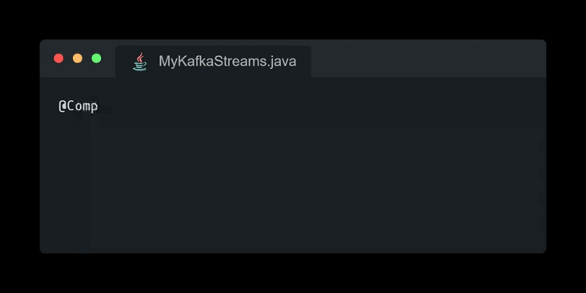

# Kstreamplify

[](https://img.shields.io/github/actions/workflow/status/michelin/kstreamplify/on_push_main.yml)
[](https://central.sonatype.com/search?q=com.michelin.kstreamplify&sort=name)
[](https://github.com/michelin/kstreamplify/releases)
[](https://github.com/michelin/kstreamplify/commits/main)
[](https://github.com/michelin/kstreamplify)
[](https://github.com/michelin/kstreamplify)
[](https://sonarcloud.io/component_measures?id=michelin_kstreamplify&metric=coverage&view=list)
[](https://sonarcloud.io/component_measures?metric=tests&view=list&id=michelin_kstreamplify)
[](https://opensource.org/licenses/Apache-2.0)

Are you looking to enhance your development experience and accelerate the implementation of Kafka Streams? Look no
further – Kstreamplify is tailor-made for you!

**Kstreamplify** is a Java library that empowers you to swiftly create Kafka Streams-based applications, offering a host
of additional advanced features.

With Kstreamplify, you can declare your KafkaStreams class and define your topology with minimal effort. Here's all you
need to do:



## Table of Contents

* [Features](#features)
* [Dependencies](#dependencies)
    * [Java](#java)
    * [Spring Boot](#spring-boot)
    * [Unit Test](#unit-test)
* [Getting Started](#getting-started)
    * [Properties Injection](#properties-injection)
    * [Avro Serializer and Deserializer](#avro-serializer-and-deserializer)
    * [Error Handling](#error-handling)
        * [Topology](#topology)
        * [Production and Deserialization](#production-and-deserialization)
        * [Avro Schema](#avro-schema)
        * [Uncaught Exception Handler](#uncaught-exception-handler)
    * [REST Endpoints](#rest-endpoints)
    * [Hooks](#hooks)
        * [On Start](#on-start)
    * [Deduplication](#deduplication)
        * [By Key](#by-key)
        * [By Key and Value](#by-key-and-value)
        * [By Predicate](#by-predicate)
    * [Interactive Queries](#interactive-queries)
    * [Open Telemetry](#open-telemetry)
    * [Testing](#testing)
* [Motivation](#motivation)
* [Contribution](#contribution)

## Features

- **Easy bootstrapping**: Kafka Streams application bootstrapping is handled for you, allowing you to focus on topology
  implementation.

- **Avro Schema Serializer and Deserializer**: Common serializers and deserializers for all your Avro specific records.

- **Error Handling**: A strong error handling mechanism is provided for topology, production, and deserialization
  errors, and it also allows routing them into a dead letter queue (DLQ) topic.

- **REST httpEndpoints**: Some useful REST httpEndpoints, including Kubernetes liveness and readiness probes.

- **Testing**: The library eases the use of Topology Test Driver, making it easier to write your tests.

## Dependencies

Kstreamplify offers three dependencies, all compatible with Java 17 and 21.

### Java

[](https://javadoc.io/doc/com.michelin/kstreamplify-core)

To include the core Kstreamplify library in your project, add the following dependency:

```xml

<dependency>
    <groupId>com.michelin</groupId>
    <artifactId>kstreamplify-core</artifactId>
    <version>${kstreamplify.version}</version>
</dependency>
```

### Spring Boot

[](https://javadoc.io/doc/com.michelin/kstreamplify-spring-boot)

If you're using Spring Boot, you can integrate Kstreamplify with your Spring Boot application by adding the following
dependency:

```xml

<dependency>
    <groupId>com.michelin</groupId>
    <artifactId>kstreamplify-spring-boot</artifactId>
    <version>${kstreamplify.version}</version>
</dependency>
```

The dependency is compatible with Spring Boot 3.

### Unit Test

[](https://javadoc.io/doc/com.michelin/kstreamplify-core-test)

For both Java and Spring Boot dependencies, a testing dependency is available to facilitate testing:

```xml

<dependency>
    <groupId>com.michelin</groupId>
    <artifactId>kstreamplify-core-test</artifactId>
    <version>${kstreamplify.version}</version>
    <scope>test</scope>
</dependency>
```

## Getting Started

To begin using Kstreamplify, you simply need to set up a `KafkaStreamsStarter` bean within you Spring Boot context,
overriding the `topology` method.

For instance, you can start by creating a class annotated with `@Component`:

```java

@Component
public class MyKafkaStreams extends KafkaStreamsStarter {
    @Override
    public void topology(StreamsBuilder streamsBuilder) {
        // Your topology
    }

    @Override
    public String dlqTopic() {
        return "dlqTopic";
    }
}
```

Alternatively, you can annotate a method that returns a `KafkaStreamsStarter` with `@Bean`:

```java
@Bean
public KafkaStreamsStarter kafkaStreamsStarter(){
    return new KafkaStreamsStarter(){
@Override
public void topology(StreamsBuilder streamsBuilder){
    // Your topology
    }

@Override
public String dlqTopic(){
    return"dlqTopic";
    }
    };
    }
```

### Properties Injection

You can define all your Kafka Streams properties directly from the `application.yml` file as follows:

```yml
kafka:
  properties:
    bootstrap.servers: localhost:9092
    schema.registry.url: http://localhost:8081
    application.id: myKafkaStreams
    client.id: myKafkaStreams
    state.dir: /tmp/my-kafka-streams
    acks: all
    auto.offset.reset: earliest
    avro.remove.java.properties: true
```

Note that all the properties have been moved under `kafka.properties`.

### Avro Serializer and Deserializer

Whenever you need to serialize or deserialize records with Avro schemas, you can use the `SerdesUtils` class as follows:

```java
SerdesUtils.<MyAvroValue>getSerdesForValue()
```

or

```java
SerdesUtils.<MyAvroValue>getSerdesForKey()
```

Here is an example of using these methods in your topology:

```java

@Component
public class MyKafkaStreams extends KafkaStreamsStarter {
    @Override
    public void topology(StreamsBuilder streamsBuilder) {
        streamsBuilder
            .stream("inputTopic", Consumed.with(Serdes.String(), SerdesUtils.<KafkaPerson>getSerdesForValue()))
            .to("outputTopic", Produced.with(Serdes.String(), SerdesUtils.<KafkaPerson>getSerdesForValue()));
    }
}
```

### Error Handling

The library provides the ability to handle errors that may occur in your topology as well as during the production or
deserialization of records and route them to a dead-letter queue (DLQ) topic.

To do this, the first step is to override the `dlqTopic` method and return the name of your DLQ topic:

```java

@Component
public class MyKafkaStreams extends KafkaStreamsStarter {
    @Override
    public void topology(StreamsBuilder streamsBuilder) {
    }

    @Override
    public String dlqTopic() {
        return "dlqTopic";
    }
}
```

#### Topology

Kstreamplify provides utilities to handle all the unexpected errors that can occur in your topologies and route them to
a dead-letter queue (DLQ) topic automatically.

The principle is simple: whenever you perform transformations on stream values, you can encapsulate the result as either
success or failure. Failed records will be routed to your DLQ topic, while successful records will still be up for
further processing.

Here is a complete example of how to do this:

```java

@Component
public class MyKafkaStreams extends KafkaStreamsStarter {
    @Override
    public void topology(StreamsBuilder streamsBuilder) {
        KStream<String, KafkaPerson> stream = streamsBuilder
            .stream("inputTopic", Consumed.with(Serdes.String(), SerdesUtils.getSerdesForValue()));

        TopologyErrorHandler
            .catchErrors(stream.mapValues(MyKafkaStreams::toUpperCase))
            .to("outputTopic", Produced.with(Serdes.String(), SerdesUtils.getSerdesForValue()));
    }

    @Override
    public String dlqTopic() {
        return "dlqTopic";
    }

    private static ProcessingResult<KafkaPerson, KafkaPerson> toUpperCase(KafkaPerson value) {
        try {
            value.setLastName(value.getLastName().toUpperCase());
            return ProcessingResult.success(value);
        } catch (Exception e) {
            return ProcessingResult.fail(e, value, "Something bad happened...");
        }
    }
}
```

The first step is during the map values processing. The operation should return a new value of
type `ProcessingResult<V, V2>`.

- The first templatized parameter is the type of the new value after a successful transformation.
- The second templatized parameter is the type of the current value for which the transformation failed.

You can use the following to mark the result as successful:

```java
return ProcessingResult.success(value);
```

Or the following in a catch clause to mark the result as failed:

```java
return ProcessingResult.fail(e,value,"Something bad happened...");
```

The `ProcessingResult.fail()` method takes the exception, the record that failed and a custom error message.

The second step is sending the new stream of `ProcessingResult<V, V2>` to the `TopologyErrorHandler.catchErrors()`
method, which will split the
stream into two branches:

- The first branch will contain the `ProcessingError` and will be routed to the DLQ topic as a `KafkaError` Avro objects
  that contains
  multiple useful information such as the topic, the partition, the offsets, the exception, and the custom error message
  of the failed record.
- The second branch will only contain the successful records and will be returned to continue the processing.

#### Production and Deserialization

The library provides handlers for production and deserialization errors, which can be used to route these errors to the
configured DLQ topic.

Here's how to use them:

```yml
kafka:
  properties:
    default.production.exception.handler: com.michelin.kstreamplify.error.DlqProductionExceptionHandler
    default.deserialization.exception.handler: com.michelin.kstreamplify.error.DlqDeserializationExceptionHandler
```

#### Avro Schema

An Avro schema needs to be deployed in a Schema Registry on top of the DLQ topic. It is
available [here](https://github.com/michelin/kstreamplify/blob/main/kstreamplify-core/src/main/avro/kafka-error.avsc).

#### Uncaught Exception Handler

You may bring your own uncaught exception handler if you choose to do so. This provides an ability to
override the default behavior - for instance, there might be a special requirement to treat and handle certain
exception types differently.

To do this, simply override the `uncaughtExceptionHandler` method and return your own custom uncaught
exception handler that implements the standard `StreamsUncaughtExceptionHandler` interface.

```java
@Override
public StreamsUncaughtExceptionHandler uncaughtExceptionHandler(){
    return throwable->{
    // Do something when an uncaught exception occurs
    return StreamsUncaughtExceptionHandler.StreamThreadExceptionResponse.SHUTDOWN_CLIENT;
    };
    }
```

### REST endpoints

The Kstreamplify library provides several REST httpEndpoints, which are listed below:

- `GET /ready`: This httpEndpoint is used as a readiness probe for Kubernetes deployment.
- `GET /liveness`: This httpEndpoint is used as a liveness probe for Kubernetes deployment.
- `GET /topology`: This httpEndpoint returns the Kafka Streams topology as JSON.

### Hooks

Kstreamplify offers the flexibility to execute custom code through hooks. These hooks can be defined by overriding
specific methods.

#### On Start

The `On Start` hook allows you to execute code right after the Kafka Streams instantiation. It provides the Kafka
Streams instance as a parameter.

```java

@Component
public class MyKafkaStreams extends KafkaStreamsStarter {
    @Override
    public void onStart(KafkaStreams kafkaStreams) {
        // Do something before starting the Kafka Streams instance
    }
}
```

You can use this hook to perform any custom initialization or setup tasks for your Kafka Streams application.

### Deduplication

Kstreamplify facilitates deduplication of a stream based on various criteria using window stores within a specified time
frame.

The `DeduplicationUtils` class provides three deduplication implementations. Each deduplication method takes a duration
parameter that specifies how long a record will be kept in the window store for deduplication.

All deduplication methods return a `KStream<String>, ProcessingResult<V, V2>`. You may want to direct the result to
the `TopologyErrorHandler.catchErrors()` method.

**Note**: Only streams with String keys and Avro values are supported.

#### By Key

```java

@Component
public class MyKafkaStreams extends KafkaStreamsStarter {
    @Override
    public void topology(StreamsBuilder streamsBuilder) {
        KStream<String, KafkaPerson> myStream = streamsBuilder
            .stream("inputTopic");

        DeduplicationUtils
            .deduplicateKeys(streamsBuilder, myStream, Duration.ofDays(60))
            .to("outputTopicDeduplicated");
    }
}
```

#### By Key and Value

```java

@Component
public class MyKafkaStreams extends KafkaStreamsStarter {
    @Override
    public void topology(StreamsBuilder streamsBuilder) {
        KStream<String, KafkaPerson> myStream = streamsBuilder
            .stream("inputTopic");

        DeduplicationUtils
            .deduplicateKeyValues(streamsBuilder, myStream, Duration.ofDays(60))
            .to("outputTopicDeduplicated");
    }
}
```

#### By Predicate

```java

@Component
public class MyKafkaStreams extends KafkaStreamsStarter {
    @Override
    public void topology(StreamsBuilder streamsBuilder) {
        KStream<String, KafkaPerson> myStream = streamsBuilder
            .stream("inputTopic");

        DeduplicationUtils
            .deduplicateWithPredicate(streamsBuilder, myStream, Duration.ofDays(60),
                value -> value.getFirstName() + "#" + value.getLastName())
            .to("outputTopicDeduplicated");
    }
}
```

The given predicate will be used as a key in the window store. The stream will be deduplicated based on the predicate.

### Interactive Queries

Kstreamplify is designed to make your Kafka Streams instance ready
for [interactive queries](https://docs.confluent.io/platform/current/streams/developer-guide/interactive-queries.html),
including support for RPC (Remote Procedure Call).

The `application.server` property, which should contain the host:port information, is automatically handled by
Kstreamplify.
The property can be loaded in three different ways.
By order of priority:

- an environment variable whose name is defined by the `ip.env.var.name` property.

```yml
kafka:
  properties:
    ip.env.var.name: MY_APPLICATION_PORT_HOST
```

Where `MY_APPLICATION_PORT_HOST` contains the host:port information.

- an environment variable named `MY_POD_IP`. This is particularly useful when loading host:port information from
  Kubernetes.

Here's an extract of a Kubernetes deployment which set the `MY_POD_IP` environment variable in a Kubernetes environment:

```yml
...
containers:
  env:
    - name: MY_POD_IP
      valueFrom:
        fieldRef:
          fieldPath: status.podIP
...
```

- If neither the variable environment nor the `MY_POD_IP` environment variable is set, Kstreamplify
  sets `application.server` to the default value `localhost`.

### Open Telemetry

The Kstreamplify Spring Boot module simplifies the integration of [Open Telemetry](https://opentelemetry.io/) into your
Kafka Streams application
by binding all the metrics of the Kafka Streams instance to the Spring Boot registry which is used by the Open Telemetry
Java agent.

You can run your application with the Open Telemetry Java agent by including the following JVM options:

```shell
-javaagent:/opentelemetry-javaagent.jar -Dotel.traces.exporter=otlp -Dotel.logs.exporter=otlp -Dotel.metrics.exporter=otlp
```

It also facilitates the addition of custom tags to the metrics, allowing you to use them to organize your metrics in
your Grafana dashboard.

```shell
-Dotel.resource.attributes=environment=production,service.name=myNamespace,service.name=myKafkaStreams,category=orders
```

All the tags specified in the `otel.resource.attributes` property will be included in the metrics and can be observed in
the logs
during the application startup.

### Testing

For testing, you can create a test class that extends `KafkaStreamsStarterTest` and override
the `getKafkaStreamsStarter` method to return your `KafkaStreamsStarter` class.

Here is an example:

```java
public class MyKafkaStreamsTest extends KafkaStreamsStarterTest {
    private TestInputTopic<String, KafkaPerson> inputTopic;
    private TestOutputTopic<String, KafkaPerson> outputTopic;

    @Override
    protected KafkaStreamsStarter getKafkaStreamsStarter() {
        return new MyKafkaStreams();
    }

    @BeforeEach
    void setUp() {
        inputTopic = testDriver.createInputTopic("inputTopic", new StringSerializer(),
            SerdesUtils.<KafkaPerson>getSerdesForValue().serializer());

        outputTopic = testDriver.createOutputTopic("outputTopic", new StringDeserializer(),
            SerdesUtils.<KafkaPerson>getSerdesForValue().deserializer());
    }

    @Test
    void shouldUpperCase() {
        inputTopic.pipeInput("1", person);
        List<KeyValue<String, KafkaPerson>> results = outputTopic.readKeyValuesToList();
        assertThat(results.get(0).value.getFirstName()).isEqualTo("FIRST NAME");
        assertThat(results.get(0).value.getLastName()).isEqualTo("LAST NAME");
    }

    @Test
    void shouldFailAndRouteToDlqTopic() {
        inputTopic.pipeInput("1", person);
        List<KeyValue<String, KafkaError>> errors = dlqTopic.readKeyValuesToList();
        assertThat(errors.get(0).key).isEqualTo("1");
        assertThat(errors.get(0).value.getContextMessage()).isEqualTo("Something bad happened...");
        assertThat(errors.get(0).value.getOffset()).isZero();
    }
}
```

## Motivation

Developing applications with Kafka Streams can be challenging and often raises many questions for developers. It
involves considerations such as efficient bootstrapping of Kafka Streams applications, handling unexpected business
issues, and integrating Kubernetes probes, among others.

To assist developers in overcoming these challenges, we have built this library. Our aim is to provide a comprehensive
solution that simplifies the development process and addresses common pain points encountered while working with Kafka
Streams.

## Contribution

We welcome contributions from the community! Before you get started, please take a look at
our [contribution guide](https://github.com/michelin/kstreamplify/blob/master/CONTRIBUTING.md) to learn about our
guidelines and best practices. We appreciate your help in making Kstreamplify a better library for everyone.
